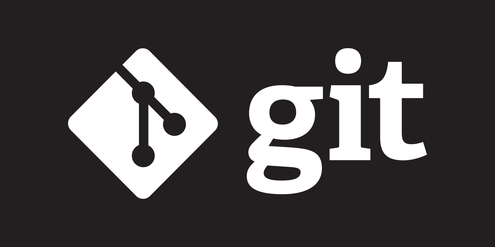

# **Git** — это распределенная система контроля версий, которая позволяет разработчикам отслеживать изменения в исходном коде и сотрудничать с другими разработчиками над одним проектом. В этой статье мы рассмотрим основные понятия и команды для работы с Git.

[Официальный сайт Git](https://git-scm.com/)

## Основные понятия Git

-  **Репозиторий**: это хранилище, содержащее все файлы и историю изменений проекта.

-  **Коммит**: фиксация изменений в репозитории с описанием внесенных изменений.

-  **Ветка (branch)**: отдельный поток разработки, который позволяет создавать и тестировать новые функции, не затрагивая основной код.

-  **Слияние (merge)**: объединение изменений из одной ветки в другую.
___

[Перейти к содержанию](главная.md) 